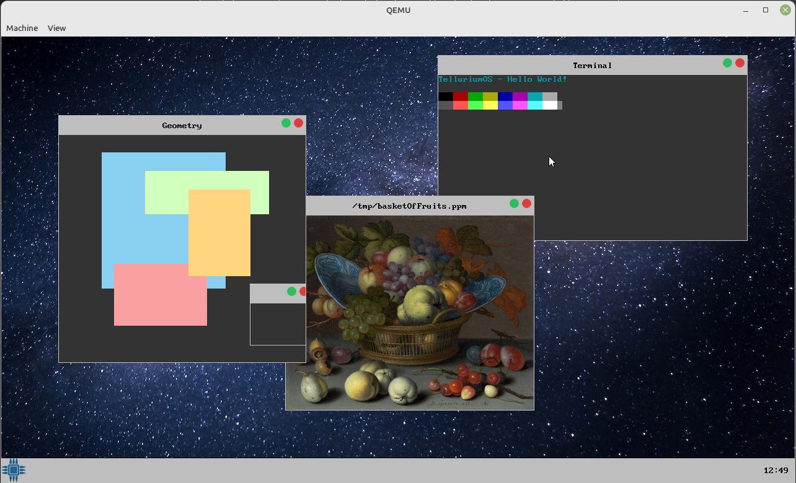

Tellurium is a modern operating system written in C/C++ booted using the Limine protocol. Tellurium's kernel is written in C, targeting x86_64 machines.

### Project Goals

- To design a usable and self-hosting system that runs on real hardware.
- To keep design choices compliant with POSIX standards.
- To port well-known programs over to Tellurium.

### Project Features

##### Kernel
- Architectures
  - x86_64.
- SMP system
  - Kernel objects and structures are SMP-aware and use locking mechanisms for synchronization.
- Kernel Logging
  - Per-core information dumped over a graphical terminal and serial communications.
- Scheduling
  - Round-robin scheduling.
  - Process as resource container for programs.
  - Thread as entity scheduler for execution.
- Device Drivers
  - Interrupt routing and timers: IOAPIC, LAPIC, HPET, PIT.
  - Machine-specific registers: MSR.
  - Keyboard and mouse: PS/2.
- File System
  - Virtual File System.
  - tmpfs and devfs file system drivers.
- Memory Management
  - Page Frame Allocator (4kB aligned allocations).
  - Virtual Memory Manager: Higher half kernel, demand paging.
  - Kernel heap: Slabs for small and large object allocations.
- IPC
  - Event-driven logic (observer pattern, threads have listeners).
  - Unix domain sockets.
- Syscall handling
  - POSIX-compliant system call implementations.

##### Userspace
- Windowing Server
  - For custom user applications and ported software.
  - Written in C++: allows for implementation of derived window utilities: buttons, images, text boxes, terminals, etc.
  - Window occlusion and dirty region algorithms to enhance performance.
- Tellurium library
  - Provides useful functions: device polling, syscall wrappers, user memory allocations, and program bootstrapping.

##### Other
- Terminal Module
  - System independent terminal emulator that supports escape sequence and ANSI codes. 
- flibc
  - Freestanding libc functions.

### Building the System
##### Requirements
- GNU make for compiling the source.
- An installation of Limine bootloader version 3.19.
- Xorisso for generating a bootable ISO.

##### Building
The installation of the bootloader should be in the same directory as Tellurium's parent. In the main directory, run the following command to compile and build the ISO:

```console
tellurium-os$ make
```

##### Running
To run the bootable ISO using QEMU, type:

```console
tellurium-os$ qemu-system-x86_64 -M q35 -m 2G -cdrom tellurium.iso -boot d -M smm=off -d int -D qemu.log -smp 2
```
The 'm' and 'smp' flags can be adjusted to change the total system memory and processor cores present, respectively.

### Screenshots

